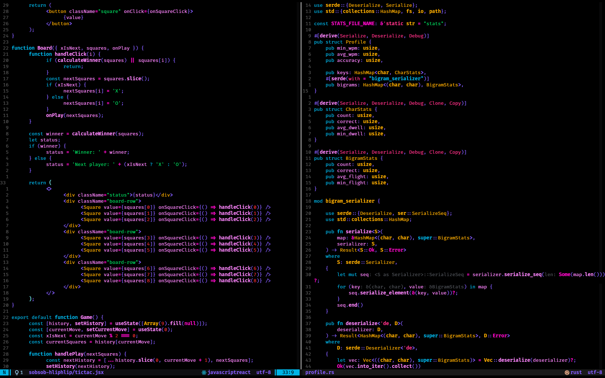
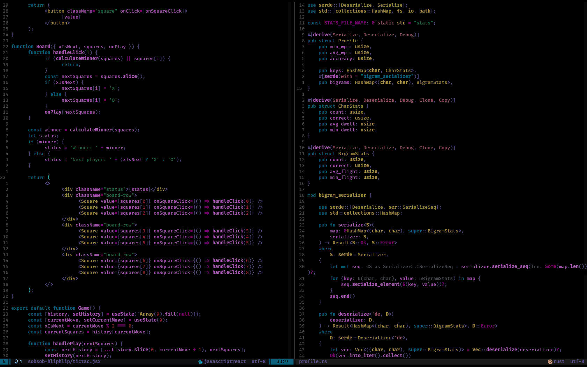
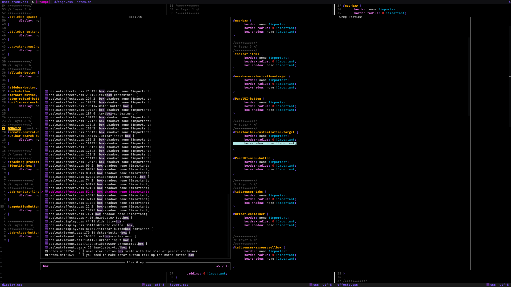

[](https://github.com/Fasamii/sobsob.nvim/stargazers)
[](LICENSE)
# SobSob
A wildcharm inspired color scheme for vim and nvim
## Examples



<details>
<summary>more examples</summary>



</details>

## Installation 
### lazy.nvim (Recommended)
```lua
require("lazy").setup({
    "Fasamii/sobsob.nvim",
    priority = 1000,
    lazy = false,
    opts = {},
})
```
### Vim-plug
```lua
Plug 'Fasamii/sobsob.nvim'
```
### Packer
```lua
use {
    'Fasamii/sobsob.nvim',
    config = function()
        vim.cmd.colorscheme("sobsob")
    end
}
```
## Configuration
### specific highlight groups
```lua
opts = {
    hi = {
        Normal = { bg = "#ff00ff", fg = "#000000" }
    }
}
```
### Or you can override specific colors in the palette
```lua
opts = {
    cp = {
        red = "#00ff00",
    }
}

```
 
if you don't like some specific colors in all highlights just change it via cp = { [color] =
[your color] } and don't bother to change all highlight groups
To check color palette and existing colors read [colors.lua](https://github.com/Fasamii/sobsob.nvim/blob/main/lua/sobsob/colors.lua) file
# Supported plugins
- [x] Treesitter
- [x] Telescope
- [x] Render-markdown
- [x] Gitsigns
- [x] Which-key
- [x] Nvim-dap-view
- [ ] Lualine (you have to set custom hl groups in lualine config(LL_I_A, LL_I_B etc...)) (but hi
groups for lualine are defined)
- [ ] Alpha
- [ ] nvim-scrollbar 

# Languages to which I paid special attention
- [X] Plain text
- [x] XML
- [x] HTML
- [x] CSS
- [X] JavaScript
- [X] Rust 
- [X] Haskell
- [X] Lua
---

<div align="center">

⭐ Star this repo if you like SobSob ⭐
[Report Bug](https://github.com/Fasamii/sobsob.nvim/issues) • [Request Feature](https://github.com/Fasamii/sobsob.nvim/issues)

</div>
